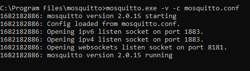
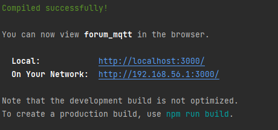

# Forum MQTT

## Présentation

C'est un projet d'école avec l'utilisation de ReactJS où l'objectif est de communiquer avec un broker MQTT.

## Fonctionnement global

Il y a 3 acteurs :
- Le client ReactJS
- Le broker Mosquitto : les topics et la communication
- Le serveur NodeJS Glitch : l'authentification de départ

## structure de données entre Mosquitto et ReactJs

pour envoyer des informations enrichies, j'ai établie cette structure de donnée

- `client-id` : l'identifiant de la personne qui envoie le message
- `client-username` : le pseudo de la personne qui envoie le message
- `message-type` : le type de message : `raw`, `info` ou `button`
- `options` : un contenue sous format JSON qui complèmente pour des actions (ex: invitation)
- `message` : le contenu du message

ils ont pour séparateur `:|:`

## Prérequis
- Node.js (https://nodejs.org)
- Broker Mosquitto (https://mosquitto.org/)

## Configuration du broker Mosquitto

Les étapes suivantes ont été réalisées sur Windows 10 et les explications seront données en conséquence.

1. Dans le projet, récupérez le fichier `mosquitto.conf` : `/public/configurations/mosquitto.conf`.
2. Aller à l'emplacement ou vous avez installer Mosquitto (pour ma part : `C:\Program Files\mosquitto`) puis remplacer le `mosquitto.conf` par celui que vous avez récupéré dans le projet

Le nouveau `mosquitto.conf` a été modifié pour accepter les requêtes websocket sur le port 8181.

## Lancement du broker Mosquitto

1. Ouvrez une fenêtre de terminal Windows (`Menu démarré -> Exécuter -> cmd`).
2. Accédez au dossier Mosquitto (Pour ma part : `cd C:\Program Files\mosquitto`).
3. Exécutez la commande suivante : `mosquitto.exe -v -c mosquitto.conf`.

Le paramètre `-v` (verbose) permet de voir les logs et `-c` indique l'utilisation de notre fichier de configuration.

À partir d'ici, vous devez avoir ce genre de résultat :

**Et voilà ! Passons maintenant à notre client web ReactJs.**

## Configuration de Forum MQTT

Cette partie est **optionnel**, par défaut le client se connecte sur `ws://localhost:8181`.

Mais si vous devez le modifier, alors cela se fera dans le `keys.ts` dans `/src/utils/`.

## Lancement de Forum MQTT

1. Ouvrez un terminal avec votre IDE, soit un terminal NodeJS.
2. Mettez vous à la racine du projet.
3. Lancer la commande `npm install` et `npm run start`.

Il faudra attendre un peu le temps que npm installe les node modules.

Vous devez à la fin avoir ça :
- sur console

- sur votre navigateur internet

# Utilisations de Forum MQTT

## Connexion et inscription

Vous avez la possibilité d'inscrire un compte ou de vous connecter avec un compte existant.

Chaque `username` est unique, vous ne pouvez pas un prendre un déjà utilisé (ou alors connectez-vous).

**IMPORTANT** : Le temps d'inscription et/ou de connexion peut prendre un peu de temps et c'est normal !

Pour la gestion des comptes, j'utilise `Glitch.com` pour faire un serveur gratuit pour l'authentification, et le serveur endormi prend un peu de temps pour se rallumer.

Vous arrivez ensuite sur le canal général où vous pourrez écrire avec d'autres personnes !

## Structure du forum

1. Menu des topics : contient tout les topics souscrits.
2. L'élément est en rouge, car il est le topic sélectionné.
3. Bouton permettant de créer un topic.
4. Permet d'envoyer un message.
5. Le chat du topic sélectionné.
6. Menu des utilisateurs : il contient toutes les conversations personnelles.
7. Notification avec le nombre de message non lu.

## Discussion personnelle entre 2 utilisateurs

Quand un utilisateur se connecte, il se met directement dans la liste des utilisateurs de droite !

Il suffit alors de cliquer sur son nom et de démarrer une discussion :).

Vous recevrez une notification si vous n'êtes pas sur le canal de discussion.

Vous avez aussi un espace personnel pour vous écrire  de jolis mots d'amour à vous-même <3 (je ne suis pas la pour juger)

## Gestion des topics personnels

Vous pouvez créer / rejoindre / quitter / inviter dans un topic ! **seul le topic général n'est pas modifiable**

### Créer un topic

1. Il suffit de cliquer en bas à gauche dans le menu des canaux `Créer un topic`
2. Entrez le nom de votre topic dans la pop-up et validez !

Vous pourrez voir et accéder à votre topic qui se situe sur la gauche.

### Invitez dans un topic
1. Cliquez sur l'icône en forme d'enveloppe à coté du nom du topic à sélectionner.
2. Cochez dans la pop-up les gens à inviter.
3. Et c'est tout ! De leurs côté  ils devront cliquer sur l'invitation, et à vous les discussions de groupe privé !

**NOTE : Seul le propriétaire du topic peut gérer les invitations (un choix du développeur)**

### Quittez dans un topic

1. Cliquez tout simplement sur la petite croix rouge à côté du nom du topic, fini !